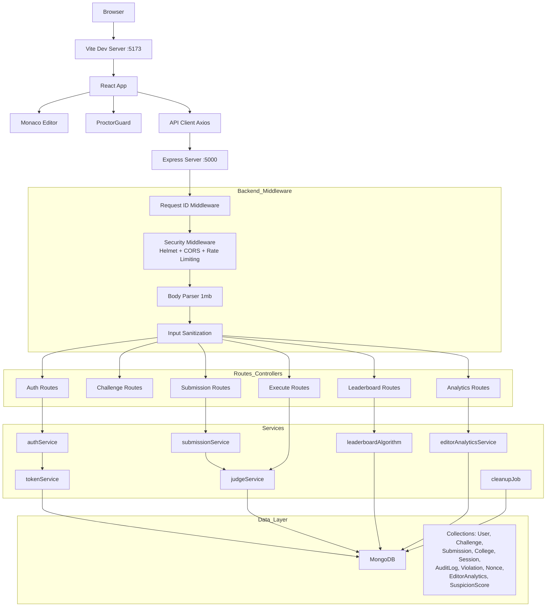

# Coding Challenge Platform

A high-security, scalable, LeetCode-style **Daily Assessment and College Leaderboard Platform** — codenamed **Amux CCP v2.0**. Built with React 19, Node.js/Express, MongoDB, and Monaco Editor.

---

## Table of Contents

1. [Overview & Purpose](#overview--purpose)
2. [Key Features](#key-features)
3. [Tech Stack](#tech-stack)
4. [System Architecture](#system-architecture)
5. [Security Architecture (Detailed)](#security-architecture-detailed)
   - [Transport & Network Security](#1-transport--network-security)
   - [Authentication & Session Security](#2-authentication--session-security)
   - [Request Security & Anti-Replay](#3-request-security--anti-replay)
   - [Input Validation & Sanitization](#4-input-validation--sanitization)
   - [Authorization & RBAC](#5-authorization--rbac)
   - [Proctoring Engine & Anti-Cheating](#6-proctoring-engine--anti-cheating)
   - [Editor Analytics & Automation Detection](#7-editor-analytics--automation-detection)
   - [Audit Logging & Monitoring](#8-audit-logging--monitoring)
   - [Secure Error Handling](#9-secure-error-handling)
   - [Database Security](#10-database-security)
   - [Code Execution Security](#11-code-execution-security)
   - [Data Cleanup & Retention](#12-data-cleanup--retention)
6. [Scoring & Ranking System](#scoring--ranking-system)
7. [API Reference](#api-reference)
8. [Project Structure](#project-structure)
9. [Prerequisites & Setup](#prerequisites--setup)

---

## Related Documentation

- [⚔️ Battle Room — Complete System Documentation](BattleRoom.md) — how Battle Rooms are created, how the judge engine works, the full room lifecycle (UPCOMING → ACTIVE → CLOSED), proctoring, scoring, leaderboard, and all `/api/battle-rooms` endpoints.

---

## Overview & Purpose

This platform is designed for **academic institutions and coding bootcamps** to run daily coding assessments with enterprise-grade integrity. It ensures fair competition through:

- **Single-submission enforcement** — one attempt per challenge per user
- **Server-authoritative contest windows** — challenges open for a fixed 24-hour window (6 PM to next day 6 PM)
- **Hidden test cases** — challenges include both public (visible) and hidden test cases to prevent answer manipulation
- **Real-time proctoring** — browser-level integrity monitoring with automatic disqualification
- **Behavioral analytics** — aggregate typing metrics and mouse movement patterns to detect automation
- **Fair college ranking** — Bayesian statistical ranking that adjusts for college population size

---

## Key Features

| Feature | Description |
|---------|-------------|
| **Daily Coding Challenges** | One challenge per day, 24-hour contest window, single-submission rule |
| **Monaco Code Editor** | Full-featured IDE-grade editor with syntax highlighting, dark theme, bracket matching |
| **Proctoring Engine** | Fullscreen enforcement, copy/paste lockdown, tab-switch detection, devtools blocking, auto-disqualification after 3 violations |
| **Authentication** | Verified registration with password login; an email OTP is required only to complete registration |
| **Bayesian College Leaderboard** | Fair ranking using Top-K Bayesian average adjusted for college population size |
| **RBAC** | Admin role for challenge creation, User role for solving |
| **Score Calculation** | Multi-factor formula: pass ratio, solve time, execution time, memory usage |
| **Editor Analytics** | Aggregate behavioral metrics (NOT keystrokes) for automation/cheating detection |
| **Suspicion Scoring** | Weighted multi-factor system (0-100) that flags suspicious submissions for review |
| **LinkedIn Share Module** | One-click share with auto-generated score badge |
| **Render Cold-Start Handler** | Terminal-style loader with dynamic status messages for server wakeup |
| **Strategy Pattern Executor** | Pluggable code execution engine (local dev / remote sandbox) |
| **Comprehensive Audit Logging** | Full audit trail for authentication, submissions, and administrative actions |
| **Nonce Replay Protection** | Cryptographic one-time tokens preventing duplicate/replay attacks on submissions |

---

## Tech Stack

| Layer | Technology | Version |
|-------|-----------|---------|
| **Frontend** | React | v19 |
| **Build Tool** | Vite | Latest |
| **Code Editor** | Monaco Editor | v0.45 |
| **Routing** | React Router | v7 |
| **Backend** | Node.js / Express | v18+/4.x |
| **ODM** | Mongoose | Latest |
| **Database** | MongoDB | v6+ (local or Atlas) |
| **Authentication** | JWT password login + registration OTP via Nodemailer | Access/refresh sessions |
| **Scheduling** | node-cron + MongoDB TTL indexes | Daily rank recalibration; expiring OTPs are removed by TTL indexes |
| **Security Headers** | Helmet | CSP, HSTS, X-Frame-Options |
| **Rate Limiting** | express-rate-limit | Tiered: general, auth, submissions |
| **Validation** | express-validator | All inputs validated server-side |

---

## System Architecture



### Middleware Pipeline (Order of Execution)

```
Incoming Request
│
├─ 1. requestIdMiddleware    → Assigns UUID X-Request-Id header
├─ 2. morgan logging         → HTTP request logging
├─ 3. securityMiddleware     
│     ├─ Helmet (CSP, HSTS, XFO, etc.)
│     ├─ Rate Limiter (tiered)
│     └─ CORS Hardening
├─ 4. express.json (1mb)     → Body parsing with size limit
├─ 5. express.urlencoded     → URL-encoded body parsing
├─ 6. sanitizeInput          → Strip null bytes & control chars, trim
│
├─ → Route Handler (with auth/validation/nonce as needed)
│
└─ 7. errorHandler           → Secure error response (no stack in prod)
```

---

## Security Architecture (Detailed)

### 1. Transport & Network Security

| Control | Implementation | Configuration |
|---------|---------------|---------------|
| **Content Security Policy** | Helmet CSP | `default-src 'self'`, `script-src 'self' 'unsafe-inline' 'unsafe-eval' cdn.jsdelivr.net`, `connect-src 'self' CLIENT_URL code-executor.onrender.com`, `frame-src 'none'`, `object-src 'none'`, `upgrade-insecure-requests` |
| **HSTS** | Helmet HSTS | `maxAge: 31536000` (1 year), `includeSubDomains: true`, `preload: true` |
| **CORS** | Custom middleware whitelist | Only `CLIENT_URL`, `localhost:5173`, `localhost:3000` allowed. Dynamic origin check. No wildcard. |
| **Referrer Policy** | Helmet | `strict-origin-when-cross-origin` |
| **X-Frame-Options** | Helmet | Denied via CSP `frame-src 'none'` |
| **Cross-Origin Policies** | Helmet | `crossOriginResourcePolicy: cross-origin` (needed for Monaco CDN) |

### 2. Authentication & Session Security

| Control | Implementation | Details |
|---------|---------------|---------|
| **Password Authentication** | Email + password | Passwords are bcrypt-hashed; login requires a verified account. |
| **Registration Verification** | Email OTP | Six-digit code verifies a new registration; OTP is not a login method. |
| **Platform Access** | Authenticated account required | Unauthenticated and guest requests cannot use platform APIs. |
| **Organization** | Requested at room join | Registration does not request organization; the entered value is saved with that room submission. |
| **OTP Expiry** | 5 minutes by default | Configurable TTL index auto-clears expired registration OTPs |
| **OTP Max Attempts** | 3 attempts | After 3 failed attempts, OTP is invalidated and a new code is required |
| **OTP Resend Cooldown** | 30 seconds | Rate-limits OTP resend requests |
| **JWT Access Token** | Login session | 12 hours expiry, signed with `JWT_SECRET`, contains `userId`, `email`, `role`, `type: "login"` |
| **JWT Refresh Token** | Rotating | 7 days expiry, cryptographically random 64-byte hex. Single-use rotation. |
| **Session Management** | MongoDB-backed | Session model tracks device info, IP, user agent. Supports multi-device. |
| **Password Login** | Rate-limited | A verified account must use its registered email and password to sign in. |
| **OTP Storage** | SHA-256 digest | The raw verification code is never stored in MongoDB. |

#### Account Flow

1. Register with a name, email, and password; organization is not collected.
2. Verify the registration email with a six-digit OTP. Only then is a session issued.
3. Sign in with the registered email and password. OTP codes cannot sign in to existing accounts.
4. Authenticated requests include the saved bearer token; sign-out revokes the session.
5. Enter an organization when joining each battle room. A creator who starts and auto-joins a room must also provide an organization; the backend snapshots it on the submission.

#### Token Lifecycle

```
1. Register (name, email, password)
   → Server stores a bcrypt-hashed password and creates a pending account
   → Sends a six-digit email verification OTP (or logs to console in dev)
   
2. Verify registration OTP (userId + otp)
   → Checks expiry, max attempts, and the registration purpose
   → Marks the account verified and creates a 12-hour login token + 7-day refresh token
   → Creates session record in DB
   
3. Access API (Bearer access_token)
   → Auth middleware verifies JWT, loads user, attaches to req
   
4. Token Expired (401 TOKEN_EXPIRED)
   → Client sends refresh token to /auth/refresh-token
   → Server rotates refresh token (old invalidated, new issued)
   → New access token issued
   
5. Logout
   → Revokes specific session or all user sessions
```

### 3. Request Security & Anti-Replay

| Control | Implementation | Details |
|---------|---------------|---------|
| **Rate Limiting (General)** | `express-rate-limit` | 100 requests per 15-minute window per IP |
| **Rate Limiting (Auth)** | `express-rate-limit` | Registration OTP: 3/15min; password login: 10/15min; OTP verification: 5/5min. |
| **Rate Limiting (Submissions)** | `express-rate-limit` | 5 requests per 1-minute window per IP |
| **Request ID** | UUID v4 middleware | Every request gets unique `X-Request-Id` header, propagated to all logs and responses |
| **Nonce Replay Protection** | Cryptographic nonce | 32 random bytes → 64-char hex string. One-time use per action per user. Required for `SUBMIT`, `RUN`, `CONTEST_START/END`, `ANALYTICS_FLUSH`. |
| **Nonce Validation** | Server-side consume | Validates format (`/^[a-f0-9]{64}$/`), action enum, user + resource binding. Atomic consume prevents reuse. |
| **Nonce Expiry** | 24-hour TTL | Auto-cleaned by MongoDB TTL index |
| **IP Tracking** | All requests | IP logged in AuditLog, Session, and rate limiting key |

### 4. Input Validation & Sanitization

| Control | Implementation | Details |
|---------|---------------|---------|
| **Body Size Limit** | `express.json({ limit: "1mb" })` | Rejects payloads over 1MB |
| **Input Sanitization** | Custom middleware | Strips null bytes (`\x00`), control characters (`\x00-\x08\x0B\x0C\x0E-\x1F`), trims whitespace from all string fields |
| **Email Validation** | express-validator | `isEmail()`, `normalizeEmail()` |
| **OTP Validation** | express-validator | Exactly 6 digits, string type |
| **Code Size Limit** | Application-level | 1 to 50,000 characters. Enforced both client-side and server-side. |
| **Challenge Validation** | express-validator | Title (3-200 chars), Description (10+ chars), TestCases (min 1), Difficulty (enum EASY/MEDIUM/HARD) |
| **MongoDB ID Validation** | express-validator | `isMongoId()` for all ID parameters |
| **Pagination Validation** | express-validator | Page (min 1), Limit (1-100) |
| **Nonce Format** | Regex validation | `/^[a-f0-9]{64}$/` — rejects malformed nonces |

### 5. Authorization & RBAC

| Control | Implementation | Details |
|---------|---------------|---------|
| **Role Enum** | `USER`, `ADMIN` | Stored on User model, indexed |
| **Auth Middleware** | `authenticate()` | Validates JWT, loads user from DB, rejects if unverified. Returns specific error codes: `NO_TOKEN`, `TOKEN_EXPIRED`, `INVALID_TOKEN`, `USER_NOT_FOUND`, `NOT_VERIFIED`. |
| **Optional Auth** | `optionalAuth()` | Sets `req.user` if valid token present, continues silently if not |
| **RBAC Middleware** | `requireRole(...roles)` | Checks `req.user.role` against allowed roles. 403 with required roles listed. |
| **Admin Guards** | `isAdmin` | Wraps `requireRole("ADMIN")` for challenge CRUD, disqualification |
| **User Guards** | `isUser` | Wraps `requireRole("USER", "ADMIN")` for standard endpoints |
| **Self-Service** | Ownership checks | Users can only update their own submissions. Admin can update any. |

### 6. Proctoring Engine & Anti-Cheating

The proctoring system (`useProctorGuard` hook + `ProctorGuard` component) provides browser-level integrity monitoring:

| Violation Type | Detection Method | Severity |
|---------------|-----------------|----------|
| **Fullscreen Exit** | `fullscreenchange` event | HIGH |
| **Tab Switch** | `visibilitychange` → `document.hidden` | HIGH |
| **Window Blur** | `window.blur` event | MEDIUM |
| **Copy Blocked** | `copy` event `preventDefault()` | MEDIUM |
| **Paste Blocked** | `paste` event `preventDefault()` | MEDIUM |
| **Cut Blocked** | `cut` event `preventDefault()` | LOW |
| **Context Menu** | `contextmenu` event `preventDefault()` | LOW |
| **Text Selection** | `selectstart` event `preventDefault()` | LOW |
| **F12 DevTools** | `keydown` F12 detection | HIGH |
| **Ctrl+Shift+I/J** | Keyboard shortcut detection | HIGH |
| **Ctrl+U (View Source)** | Keyboard shortcut detection | HIGH |
| **Ctrl+C / Cmd+C** | Clipboard shortcut blocked in editor | MEDIUM |
| **Ctrl+V / Cmd+V** | Paste shortcut blocked in editor | MEDIUM |

**Disqualification Flow:**
1. Violation counter stored in `sessionStorage` (persists across page reloads within session)
2. After `MAX_VIOLATIONS = 3`, the user is immediately disqualified
3. Overlay modal displayed: *"Assessment Disqualified"*
4. `onDisqualified` callback triggers server-side submission disqualification
5. Submission status set to `DISQUALIFIED`, score zeroed out

### 7. Editor Analytics & Automation Detection

The platform collects **aggregate behavioral metadata only** — never actual keystrokes or code content.

| Metric | Description | Detection Use |
|--------|-------------|---------------|
| `typingDuration` | Total time spent typing (ms) | Pace analysis |
| `idleDuration` | Total idle time (ms) | Pattern analysis |
| `cursorMovementCount` | Number of cursor moves | Human interaction |
| `mouseMoveCount` | Number of mouse moves | **No mouse movement → automation risk** |
| `mouseClickCount` | Number of mouse clicks | Human interaction |
| `totalCharactersTyped` | Total characters typed | Scale analysis |
| `averageTypingSpeed` | Average chars per minute | **>300 CPM → automation risk** |
| `typingConsistencyScore` | 0-100 consistency metric | **>90 consistency → automation risk** |
| `correctionCount` | Number of edits/corrections | **Zero corrections on >100 chars → automation risk** |
| `pasteCount` | Number of paste events | Integrity metric |
| `copyCount` | Number of copy events | Integrity metric |
| `fullscreenExits` | Fullscreen exit count | Violation tracking |
| `windowBlurCount` | Window blur events | Focus tracking |
| `visibilityChanges` | Tab visibility changes | Tab-switch tracking |
| `undoCount` / `redoCount` | Editor undo/redo count | Pattern analysis |

**Automation Risk Scoring (0-100):**

| Factor | Weight | Threshold |
|--------|--------|-----------|
| No mouse movement | +25 | `mouseMoveCount === 0` |
| Very regular typing intervals | +20 | `veryRegularIntervals === true` |
| Zero corrections | +15 | `correctionCount === 0 && totalCharactersTyped > 100` |
| High typing speed (>300 CPM) | +10 | `averageTypingSpeed > 300 && totalCharactersTyped > 200` |
| Long inactivity then rapid edits | +20 | `longInactivityThenRapidEdits === true` |
| Consistent perfect timing | +15 | `typingConsistencyScore > 90 && totalCharactersTyped > 200` |

**Suspicion Levels:**
- **LOW** (0-19): Normal behavior
- **MEDIUM** (20-39): Flagged for review
- **HIGH** (40-69): Auto-flagged, manual review recommended
- **CRITICAL** (70-100): Strong automation indicators

### 8. Audit Logging & Monitoring

| Feature | Implementation | Details |
|---------|---------------|---------|
| **Audit Trail** | `AuditLog` model | Every significant action logged with userId, action, resource, IP, user-agent, requestId |
| **Logged Actions** | Middleware shortcuts | `USER_LOGIN`, `USER_LOGOUT`, `SUBMISSION_CREATE`, `CHALLENGE_CREATE/UPDATE/DELETE`, `SUBMISSION_DISQUALIFY`, `CODE_RUN` |
| **Severity Classification** | INFO / WARN / ERROR / CRITICAL | Auto-derived from HTTP status code |
| **Status Tracking** | SUCCESS / FAILURE / PENDING | Based on response status |
| **Request Correlation** | requestId | Every audit entry linked to request UUID for full traceability |
| **TTL Auto-Cleanup** | 90 days | Audit logs auto-delete after 90 days via MongoDB TTL index |
| **IP & User Agent** | Captured on all logs | Forensic data for investigation |

### 9. Secure Error Handling

| Scenario | Response | Details |
|----------|----------|---------|
| **Validation Error** | 400 `{ error, details, requestId }` | Includes field-level validation messages |
| **Invalid MongoDB ID** | 400 `{ error, requestId }` | Safe message, no ID leaked |
| **Duplicate Key** | 409 `{ error, requestId }` | Safe duplicate error |
| **Authentication Error** | 401 `{ error, code, requestId }` | Specific codes: `NO_TOKEN`, `TOKEN_EXPIRED`, `INVALID_TOKEN` |
| **Authorization Error** | 403 `{ error, requiredRoles, userRole }` | Lists required vs actual role |
| **Rate Limit Exceeded** | 429 `{ error }` | Standard rate limit response |
| **Internal Error (Dev)** | 500 `{ error, details, stack, requestId }` | Stack trace exposed only in development |
| **Internal Error (Prod)** | 500 `{ error, requestId }` | Generic message, no internals leaked |
| **404 Not Found** | 404 `{ error, path, requestId }` | Path echoed for debugging |

### 10. Database Security

| Control | Implementation |
|---------|---------------|
| **ODM Protection** | Mongoose prevents NoSQL injection via schema validation |
| **Selective Field Exposure** | Every model has `toPublicJSON()` / `toJSON()` methods that control what's exposed |
| **Sensitive Fields Hidden** | User OTP fields use `select: false` — excluded from all normal queries |
| **TTL Indexes** | Auto-delete expired data: Sessions (at expiry), Nonces (24h), Violations (1 year), AuditLogs (90 days), EditorAnalytics (1 year) |
| **Compound Indexes** | Performance-optimized indexes on all query patterns |
| **Unique Constraints** | Email (unique), Submission per user+challenge (unique compound), Slug (unique), Nonce value (unique), College name (unique) |
| **Graceful Degradation** | Server starts without DB, logs warning, continues with limited functionality |

### 11. Code Execution Security

| Control | Implementation |
|---------|---------------|
| **Strategy Pattern** | Pluggable executor (local dev / remote sandbox) |
| **Remote Sandbox** | Code executed on `https://code-executor.onrender.com` — isolated environment |
| **Code Size Limit** | Maximum 50,000 characters enforced |
| **Hidden Test Cases** | Never sent to client. Only server sees hidden test case inputs/outputs. |
| **Public Test Case Limit** | Runs limited to 5 public test cases |
| **Expected Output Hiding** | Expected outputs stripped from all API responses |
| **CSP Restriction** | `connect-src` only allows the configured executor URL |

### 12. Data Cleanup & Retention

| Job | Schedule | Action |
|-----|----------|--------|
| **Creator OTP Expiry** | Automatic (MongoDB TTL) | Creator verification codes are removed at their configured `expiresAt` |
| **College Rank Recalibration** | Daily at midnight (cron) | Recalculates and reorders college rankings |
| **Battle Room Results** | Retained until creator deletion | Closed rooms and submissions are not automatically purged |
| **Session TTL** | Automatic (MongoDB TTL) | Expired sessions auto-deleted at `expiresAt` |
| **Nonce TTL** | Automatic (MongoDB TTL) | Unused nonces auto-deleted after 24 hours |
| **Audit Log TTL** | Automatic (MongoDB TTL) | Logs auto-deleted after 90 days |
| **Violation TTL** | Automatic (MongoDB TTL) | Violations auto-deleted after 1 year |
| **Editor Analytics TTL** | Automatic (MongoDB TTL) | Analytics auto-deleted after 1 year |

---

## Scoring & Ranking System

### Individual Score Formula

```
Score = (PassRatio × 1000) - (SolveTime × 0.5) - (ExecutionTime × 0.1) - (MemoryUsage × 0.05)

Where:
  PassRatio      = passedTests / totalTests
  SolveTime      = time from first edit to submission (seconds)
  ExecutionTime  = total test execution time (ms)
  MemoryUsage    = peak memory usage (MB)
```

Minimum score is 0 (no negative scores).

### Bayesian College Ranking

```
K = min(participants, 5)
TopKAvg = sum(highest K scores) / K
ParticipationMultiplier = 0.85 + 0.15 × ln(participants) / ln(participants + 5)
BayesianScore = TopKAvg × ParticipationMultiplier
```

- **Top-K Average**: Only the top 5 performers from each college count, preventing large colleges from dominating purely by volume
- **Participation Boost**: Colleges with more participants get a small logarithmic boost (max +15%), rewarding engagement without overwhelming the skill signal
- **Recalibration**: College rankings are auto-recalculated daily at midnight

---

## API Reference

### Authentication

| Method | Endpoint | Auth | Rate Limit | Description |
|--------|----------|------|-----------|-------------|
| `POST` | `/api/auth/request-otp` | No | 3/15min | Begin registration with name, email, and password |
| `POST` | `/api/auth/verify-otp` | No | 5/5min | Verify registration email and receive a session |
| `POST` | `/api/auth/login-password` | No | 10/15min | Sign in with registered email and password |
| `POST` | `/api/auth/resend-otp` | No | 5/15min | Resend registration OTP (30s cooldown) |
| `POST` | `/api/auth/refresh-token` | No | 10/15min | Rotate refresh token |
| `POST` | `/api/auth/logout` | Yes | 100/15min | Revoke session |
| `POST` | `/api/auth/logout-all` | Yes | 100/15min | Revoke all sessions |
| `GET` | `/api/auth/sessions` | Yes | 100/15min | List active sessions |
| `GET` | `/api/auth/profile` | Yes | 100/15min | Get user profile |

### Challenges

| Method | Endpoint | Auth | Role | Description |
|--------|----------|------|------|-------------|
| `GET` | `/api/challenges/today` | Yes | USER/ADMIN | Get today's active challenge |
| `GET` | `/api/challenges` | Yes | USER/ADMIN | List all challenges (paginated) |
| `GET` | `/api/challenges/:id` | Yes | USER/ADMIN | Get challenge details |
| `POST` | `/api/challenges` | Yes | ADMIN | Create new challenge |
| `PUT` | `/api/challenges/:id` | Yes | ADMIN | Update challenge |
| `DELETE` | `/api/challenges/:id` | Yes | ADMIN | Deactivate challenge |

### Submissions

| Method | Endpoint | Auth | Rate Limit | Description |
|--------|----------|------|-----------|-------------|
| `POST` | `/api/submissions` | Yes | 5/1min | Create submission (single per challenge) |
| `GET` | `/api/submissions/:challengeId` | Yes | 100/15min | Get submission result |
| `GET` | `/api/submissions/history` | Yes | 100/15min | Get paginated submission history |
| `PUT` | `/api/submissions/:id/result` | Judge callback key | 100/15min | Update execution result using `X-Judge-Callback-Key` |
| `PUT` | `/api/submissions/:id/disqualify` | Yes | 5/1min | Admin disqualify submission |

### Code Execution

| Method | Endpoint | Auth | Nonce | Description |
|--------|----------|------|-------|-------------|
| `POST` | `/api/execute/run` | Yes | No | Run code against public test cases (unlimited, no submission) |
| `POST` | `/api/execute/submit` | Yes | **Required** | Final submission against ALL test cases (single use) |
| `GET` | `/api/execute/health` | No | No | Judge engine health check |

### Leaderboard

| Method | Endpoint | Auth | Description |
|--------|----------|------|-------------|
| `GET` | `/api/leaderboard/global` | Yes | Global user leaderboard (top 100) |
| `GET` | `/api/leaderboard/college` | Yes | Bayesian college leaderboard (top 50) |

### Analytics (Admin)

| Method | Endpoint | Auth | Description |
|--------|----------|------|-------------|
| `GET` | `/api/analytics/suspicious` | Admin | List suspicious submissions (HIGH/CRITICAL) |
| `POST` | `/api/analytics/flush` | Admin | Flush analytics buffer |

### System

| Method | Endpoint | Auth | Description |
|--------|----------|------|-------------|
| `GET` | `/api/health` | No | Health check (DB status, uptime, version) |

---

## Project Structure

```
coding-challenge-platform/
├── backend/
│   ├── .env.example
│   ├── src/
│   │   ├── server.js              # Express entry point (middleware pipeline, route mounting)
│   │   ├── config/
│   │   │   ├── db.js              # MongoDB connection with graceful degradation
│   │   │   └── env.js             # Environment config with validation
│   │   ├── models/
│   │   │   ├── User.js            # OTP auth, RBAC roles, auto name extraction
│   │   │   ├── Challenge.js       # Test cases (public/hidden), active dates
│   │   │   ├── Submission.js      # Single-submission enforcement, scoring
│   │   │   ├── College.js         # Bayesian rank tracking
│   │   │   ├── Session.js         # Refresh token session management
│   │   │   ├── AuditLog.js        # Full audit trail (90-day retention)
│   │   │   ├── Violation.js       # 21 violation types, severity levels
│   │   │   ├── Nonce.js           # Cryptographic replay protection
│   │   │   ├── EditorAnalytics.js # Aggregate behavioral metrics (no keystrokes)
│   │   │   └── SuspicionScore.js  # Weighted multi-factor suspicion scoring
│   │   ├── middleware/
│   │   │   ├── requestId.js       # UUID request tracing
│   │   │   ├── security.js        # Helmet, CORS, rate limiting, sanitization, error handler
│   │   │   ├── auth.js            # JWT authentication (required + optional)
│   │   │   ├── rbac.js            # Role-based access control
│   │   │   ├── validate.js        # express-validator rules for all endpoints
│   │   │   ├── nonce.js           # Replay protection middleware
│   │   │   ├── auditLog.js        # Action audit logging middleware
│   │   │   └── contest.js         # Contest window validation (6PM-6PM)
│   │   ├── controllers/
│   │   │   ├── authController.js        # OTP request/verify, session management
│   │   │   ├── challengeController.js   # CRUD for challenges
│   │   │   ├── submissionController.js  # Submit, query, disqualify
│   │   │   ├── executeController.js     # Code run/submit with test case isolation
│   │   │   ├── leaderboardController.js # User/college rankings
│   │   │   └── analyticsController.js   # Suspicious submission review
│   │   ├── services/
│   │   │   ├── authService.js          # OTP generation, verification, email transport
│   │   │   ├── tokenService.js         # JWT generation, session CRUD, token rotation
│   │   │   ├── submissionService.js    # Score calculation, user/challenge stats
│   │   │   ├── judgeService.js         # Strategy pattern executor (local/remote)
│   │   │   ├── leaderboardAlgorithm.js # Bayesian ranking, persistence
│   │   │   ├── editorAnalyticsService.js # Automation detection, violation tracking
│   │   │   └── cleanupJob.js           # Cron-based stale data cleanup
│   │   └── routes/
│   │       ├── authRoutes.js
│   │       ├── challengeRoutes.js
│   │       ├── submissionRoutes.js
│   │       ├── executeRoutes.js
│   │       ├── leaderboardRoutes.js
│   │       └── analyticsRoutes.js
├── frontend/
│   ├── .env.example
│   ├── src/
│   │   ├── App.jsx / main.jsx
│   │   ├── pages/               # Home, Challenge, Login, Register, Leaderboard, Profile
│   │   ├── components/
│   │   │   ├── editor/          # CodeEditor, CodeEditorSandbox, ProctorGuard, Console, RenderAwakeLoader, ShareModal
│   │   │   ├── leaderboard/     # LeaderboardTable
│   │   │   ├── layout/          # Navbar, Footer, Sidebar
│   │   │   ├── problem/         # ProblemDescription, TestCasePanel
│   │   │   └── common/          # ProtectedRoute
│   │   ├── hooks/               # useProctorGuard
│   │   ├── context/             # AuthContext
│   │   ├── services/            # Axios client with auto-refresh, API services
│   │   └── utils/               # Constants, helpers
├── database/
│   ├── schema.sql               # SQL reference schema
│   └── schema.prisma            # Prisma schema (optional ORM)
├── docs/
│   └── architecture.md          # Architecture documentation
├── SETUP.md                     # Detailed setup instructions
└── README.md                    # This file
```

---

## Prerequisites & Setup

### Prerequisites

- **Node.js** v18+ and npm
- **MongoDB** v6+ (local or cloud Atlas)
- **SMTP credentials** for email (Ethereal for dev, Gmail for production)

### Quick Start (5 minutes)

```bash
# 1. Install dependencies
cd backend && npm install
cd ../frontend && npm install

# 2. Configure environment
#    Copy and edit these files:
#    backend/.env  → Set MONGODB_URI, EMAIL creds, JWT_SECRET
#    frontend/.env → Set VITE_API_URL

# 3. Start backend (Terminal 1)
cd backend && npm run dev

# 4. Start frontend (Terminal 2)
cd frontend && npm run dev

# 5. Open browser
open http://localhost:5173
```

### Environment Variables

#### Backend (`backend/.env`)

| Variable | Description | Default | Security Impact |
|----------|-------------|---------|-----------------|
| `PORT` | Server port | 5000 | - |
| `NODE_ENV` | Environment | development | Controls error detail exposure |
| `CLIENT_URL` | Frontend URL for CORS | http://localhost:5173 | CORS whitelist |
| `API_PUBLIC_URL` | Public backend API base URL used in emailed certificate links (include `/api`) | `http://localhost:5000/api` in development; production falls back to `${CLIENT_URL}/api` | Certificate downloads must be reachable by recipients |
| `MONGODB_URI` | MongoDB connection string | mongodb://localhost:27017/coding-challenge-platform | Database access |
| `JWT_SECRET` | Secret for JWT signing | (required) | **Must be strong random string** |
| `JWT_REFRESH_SECRET` | Secret for refresh tokens | (required) | **Must be different from JWT_SECRET** |
| `EMAIL_HOST` | SMTP host | (required for email delivery) | Creator OTP and battle result/certificate email |
| `EMAIL_PORT` | SMTP port | 587 | Email delivery |
| `EMAIL_USER` | SMTP username | (required for email delivery) | Email delivery |
| `EMAIL_PASS` | SMTP password | (required for email delivery) | Email delivery |
| `RENDER_EXECUTOR_URL` | Remote code executor | https://code-executor.onrender.com | Sandboxed execution |
| `RATE_LIMIT_WINDOW_MS` | Rate limit window | 900000 (15min) | DoS protection |
| `RATE_LIMIT_MAX` | Max requests per window | 100 | DoS protection |
| `OTP_EXPIRY_MINUTES` | OTP validity duration | 10 | Auth security |
| `OTP_TTL_SECONDS` | Creator OTP validity duration | 300 | Creator verification |
| `OTP_MAX_ATTEMPTS` | Max OTP verification attempts | 5 | Brute force protection |
| `OTP_RESEND_COOLDOWN_SECONDS` | OTP resend cooldown | 30 | Abuse prevention |
| `JUDGE_CALLBACK_SECRET` | Secret for judge-result callbacks | (unset; endpoint disabled until configured) | Internal callback authentication |
| `JWT_EXPIRY` | Access token lifespan | 15m | Session security |
| `JWT_REFRESH_EXPIRY` | Refresh token lifespan | 7d | Session security |
| `JWT_ISSUER` | JWT issuer claim | amux-ccp | Token validation |

#### Frontend (`frontend/.env`)

| Variable | Description | Default |
|----------|-------------|---------|
| `VITE_API_URL` | Backend API base URL, including `/api` | `https://ccp-backend-qylz.onrender.com/api` |

When deploying the frontend, set `VITE_API_URL` to the deployed backend URL
including `/api` in the frontend host's build environment. The backend's
`CLIENT_URL` must be set to the frontend's HTTPS origin so its CORS policy
allows browser requests from the deployed site.

---

## License

MIT
